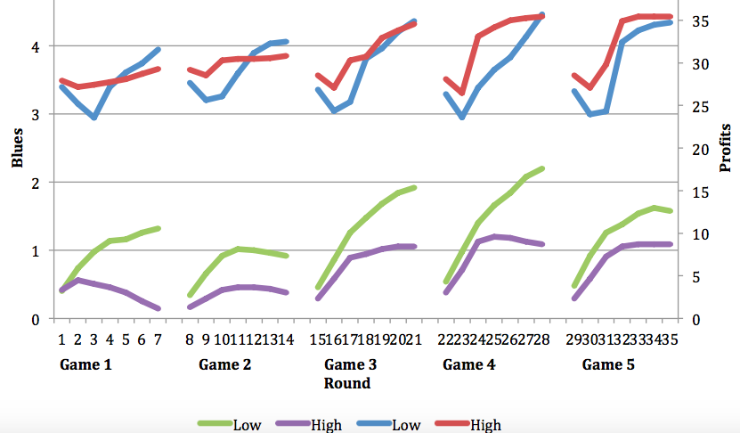
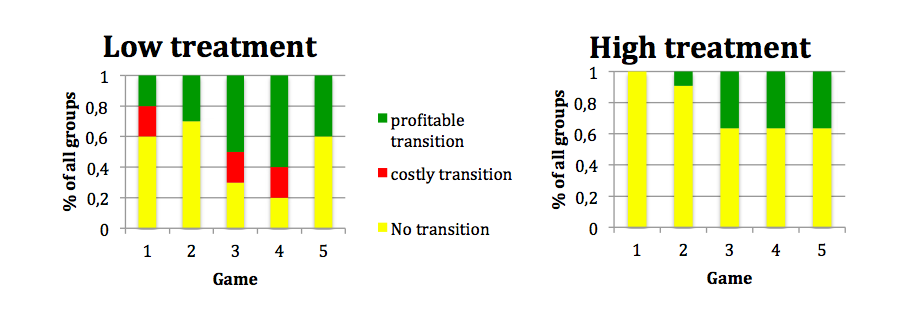

% Master thesis defence
% Tim Schrama
% TiSEM, Tilburg University

Introduction
================

----------
- Environment

- Gerlagh and Van der Heijden (2015)
 
- five-player game and different incentives

Game
====

General information
---------------------------

- Blue and purple chips

- Different payoff schemes

Rules
---------
1. Changing 1 chip per round

2. No negative numbers allowed

3. No communication

Method
======

\begin{align}

\end{align}

Figure 1
---------

Figure 2
--------

Conclusion
=============

Conclusion
---------------

- I have learned how to use formulas in fancy presentations
- The same holds for figures
- I could make this presentation longer with copy pasting, but that seems useless
